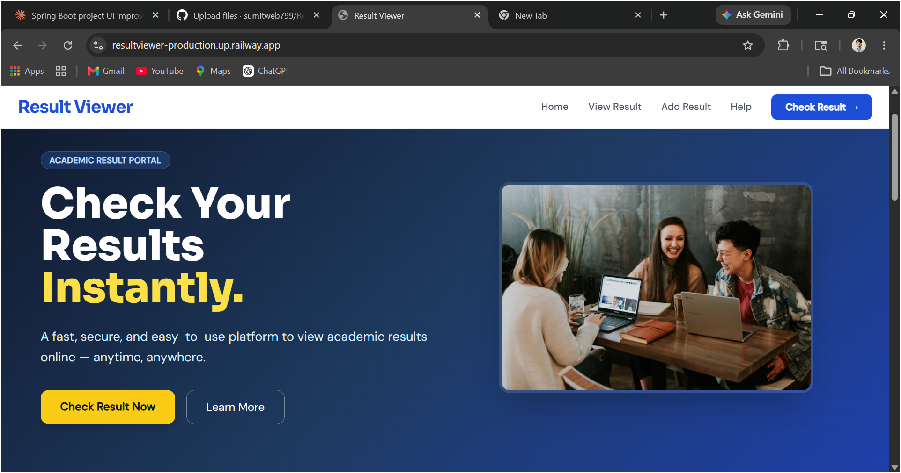
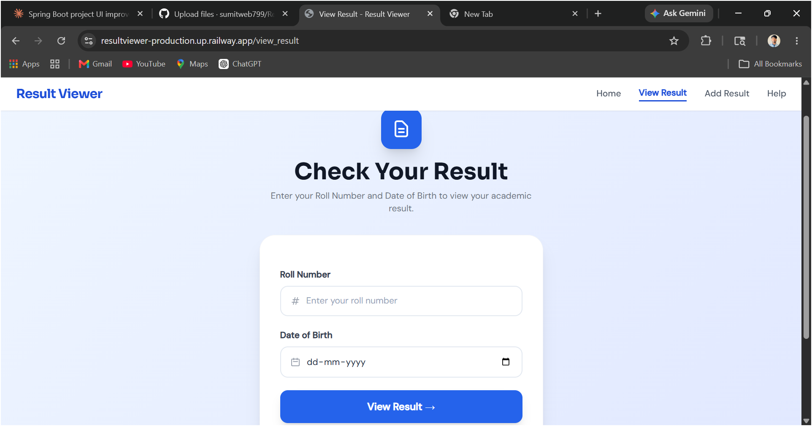
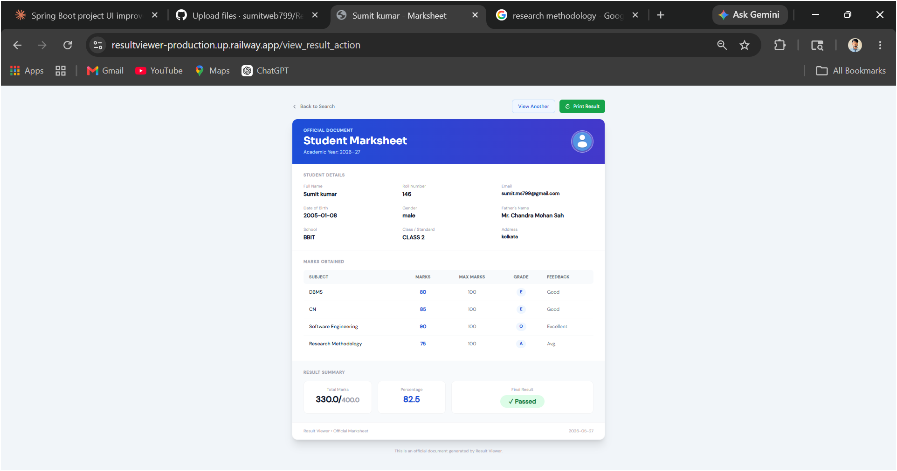

# 📋 Result Viewer

> A modern web application to manage and view student academic results — built with Spring Boot & Thymeleaf.


---

## 🌐 Live Demo

🔗 **[View Live →](https://resultviewer-production.up.railway.app/)**

---

## ✨ Features

- 🔐 **Secure Admin Login** — Spring Security powered authentication
- ➕ **Add Student Results** — Add student details, subject marks, grades & feedback
- 📄 **View Marksheet** — Students can view their result using Roll Number & DOB
- 🖨️ **Print Result** — Clean print-ready marksheet
- 📱 **Fully Responsive** — Works on mobile, tablet & desktop
- 🎨 **Modern UI** — Built with Tailwind CSS

---

## 🛠️ Tech Stack

| Technology | Usage |
|---|---|
| Java 22 | Backend Language |
| Spring Boot 3.5 | Web Framework |
| Spring Security | Authentication |
| Spring Data JPA | Database ORM |
| Hibernate | ORM Implementation |
| MySQL | Database |
| Thymeleaf | Template Engine |
| Tailwind CSS | Frontend Styling |
| Railway | Cloud Hosting |

---

## 📸 Screenshots

| Home Page | View Result | Marksheet |
|---|---|---|
|  |  |  |

---

## 🚀 Getting Started

### Prerequisites

- Java 22+
- Maven
- MySQL 8.0+

### Installation

**1. Clone the repository**
```bash
git clone https://github.com/sumitweb799/Result_Viewer.git
cd Result_Viewer
```

**2. Setup Database**
```sql
CREATE DATABASE jdbc;
```

**3. Configure application.properties**
```bash
cp src/main/resources/application.properties.example src/main/resources/application.properties
```
Then fill in your local values in `application.properties`.

**4. Run the application**
```bash
./mvnw spring-boot:run
```

**5. Open in browser**
```
http://localhost:8085
```

---

## 🔑 Default Credentials

| Role | Username | Password |
|---|---|---|
| Admin | user | user |

---

## 📁 Project Structure

```
result-viewer/
├── src/
│   ├── main/
│   │   ├── java/
│   │   │   └── com/result/view/result_viewer/
│   │   │       ├── controller/
│   │   │       ├── entity/
│   │   │       ├── repository/
│   │   │       ├── service/
│   │   │       └── utils/
│   │   └── resources/
│   │       ├── templates/
│   │       │   ├── admin/
│   │       │   │   └── add_result.html
│   │       │   ├── index.html
│   │       │   ├── login_page.html
│   │       │   ├── view_result.html
│   │       │   ├── view_result_form.html
│   │       │   └── help.html
│   │       └── application.properties.example
└── pom.xml
```

---

## ☁️ Deployment

This project is deployed on **Railway** with:
- Spring Boot app as a service
- MySQL as a managed database
- Environment variables for secure credential management

---

## 🤝 Contributing

Contributions are welcome! Feel free to open an issue or submit a pull request.

---

## 📄 License

This project is open source and available under the [MIT License](LICENSE).

---

<div align="center">

Made with ❤️ by **Sumit Kumar**

⭐ **Star this repo if you found it helpful!**

</div>
